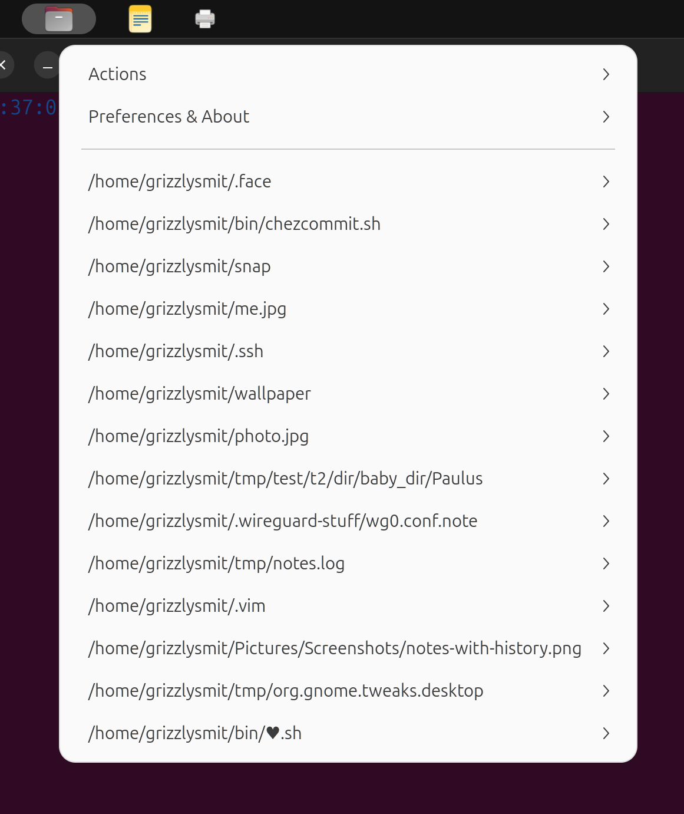

Files Launcher
==============

A menu full of files to launch.

files-launcher is a menu that allows you to launch arbitary files options are view, edit or run (if it is an executable), you can also put directories in it and then the options will be list, open in the default File Browser, or in the default shell 🤠.

